---
## Front matter
title: "Росийский университет Дружбы Народов"
title: "Отчет по Лабораторной работе №5"
subtitle:"По теме: "Основы работы с Midnight Commander(mc).Структуры программ на языке ассемблера NASM. Системные вызовы в OC GNU LINUX"
author: "Пателепень Филипп НММ-04-24"

## Generic otions
lang: ru-RU
toc-title: "Содержание"

## Bibliography
bibliography: bib/cite.bib
csl: pandoc/csl/gost-r-7-0-5-2008-numeric.csl

## Pdf output format
toc: true # Table of contents
toc-depth: 2
lof: true # List of figures
lot: true # List of tables
fontsize: 12pt
linestretch: 1.5
papersize: a4
documentclass: scrreprt
## I18n polyglossia
polyglossia-lang:
  name: russian
  options:
	- spelling=modern
	- babelshorthands=true
polyglossia-otherlangs:
  name: english
## I18n babel
babel-lang: russian
babel-otherlangs: english
## Fonts
mainfont: IBM Plex Serif
romanfont: IBM Plex Serif
sansfont: IBM Plex Sans
monofont: IBM Plex Mono
mathfont: STIX Two Math
mainfontoptions: Ligatures=Common,Ligatures=TeX,Scale=0.94
romanfontoptions: Ligatures=Common,Ligatures=TeX,Scale=0.94
sansfontoptions: Ligatures=Common,Ligatures=TeX,Scale=MatchLowercase,Scale=0.94
monofontoptions: Scale=MatchLowercase,Scale=0.94,FakeStretch=0.9
mathfontoptions:
## Biblatex
biblatex: true
biblio-style: "gost-numeric"
biblatexoptions:
  - parentracker=true
  - backend=biber
  - hyperref=auto
  - language=auto
  - autolang=other*
  - citestyle=gost-numeric
## Pandoc-crossref LaTeX customization
figureTitle: "Рис."
tableTitle: "Таблица"
listingTitle: "Листинг"
lofTitle: "Список иллюстраций"
lotTitle: "Список таблиц"
lolTitle: "Листинги"
## Misc options
indent: true
header-includes:
  - \usepackage{indentfirst}
  - \usepackage{float} # keep figures where there are in the text
  - \floatplacement{figure}{H} # keep figures where there are in the text
---

# Цель работы
Приобретение практических навыков работы в Midnight Commander. Освоение инструкций языка ассемблера mov и int.

# Выполнение лабораторной работы

5.3. Порядок выполнения лабораторной работы

1. Я открыл Midnight Commander(mc)

2. Пользуясь клавишами ↑ , ↓ и Enter я перешел в каталог ~/work/arch-pc созданный при выполнении лабораторной работы №4

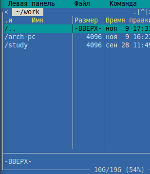

3. С помощью функциональной клавиши F7 создал папку lab05 и перешёл в созданный каталог.

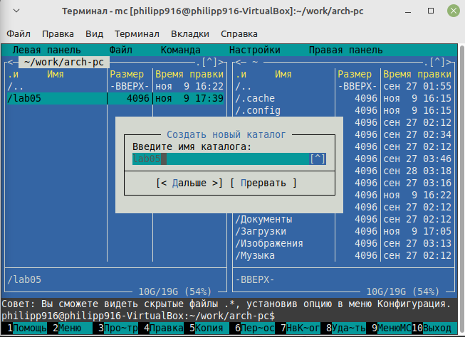

4. Пользуясь строкой ввода и командой touch создал файл lab5-1.asm

5. С помощью функциональной клавиши F4 открыл файл lab5-1.asm для редактирования во встроенном редакторе.Использовал редактор nano.

6. Ввел текст программы из листинга 5.1,а также сохранил изменения и закрыл файл.

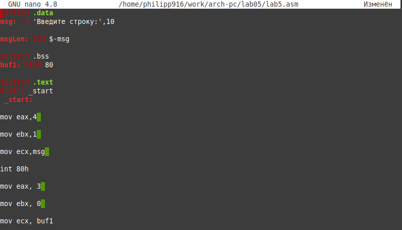
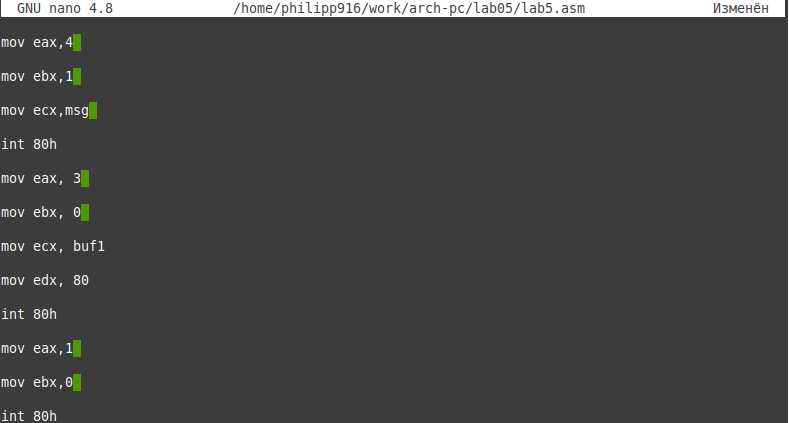

7. С помощью функциональной клавиши F3 я открыл файл lab5-1.asm для просмотра. Убедился, что файл содержит текст программы.

8. Оттранслировав текст программы lab5-1.asm в объектный файл а также выполнив компоновку объектного файла и запустив получившийся исполняемый файл, программа вывела строку 'Введите строку:'  На запрос ввел своё ФИО.

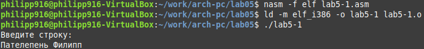

5.3.1. Подключение внешнего файла in_out.asm

9. Я Скачал файл in_out.asm со страницы курса в ТУИС, и переместил его в тот же каталог, что и файл с программой, в которой он используется.

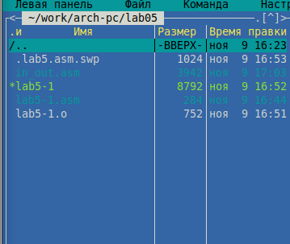

10. С помощью функциональной клавиши F6 создал копию файла lab5-1.asm с именем lab5-2.asm. Выделив файл lab5-1.asm, нажал клавишу F6 , ввел имя файла lab5-2.asm и нажал клавишу Enter.

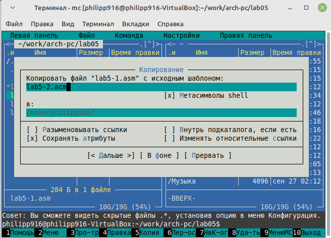
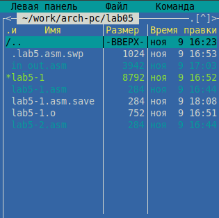

11. Я исправил текст программы в файле lab5-2.asm с использование подпрограмм из внешнего файла in_out.asm в соответствии с листингом 

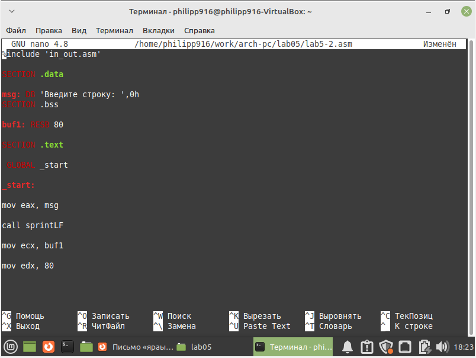

13. Создал исполняемый файл и проверил его работу.

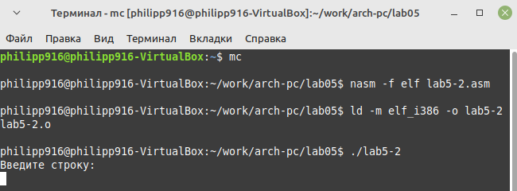

14. В файле lab5-2.asm заменил подпрограмму sprintLF на sprint. Создал исполняемый файл и проверьте его работу. Заметил разницу в выводе.

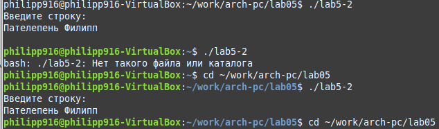

5.4. Задание для самостоятельной работы

1. Я создал копию файла lab5-1.asm. Внес изменения в программу (без использования внешнего файла in_out.asm), так чтобы она работала по следующему алгоритму: 

• вывести приглашение типа “Введите строку:”; 

• ввести строку с клавиатуры; 

• вывести введённую строку на экран

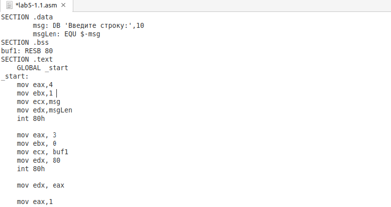
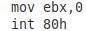

2. Получил исполняемый файл и проверил его работу. На приглашение ввести строку ввел свою фамилию.

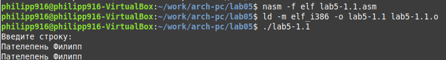 

3. Я создал копию файла lab5-2.asm. Исправив текст программы с использование подпрограмм из внешнего файла in_out.asm, так чтобы она работала по следующему алгоритму: 

• вывести приглашение типа “Введите строкy:”; 

• ввести строку с клавиатуры; 

• вывести введённую строку на экран

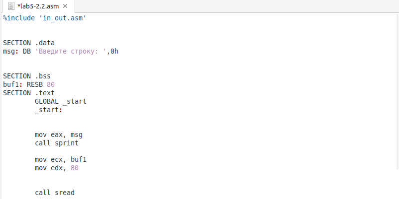
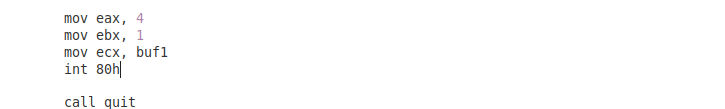

4. Создал исполняемый файл и провеил его работу. 

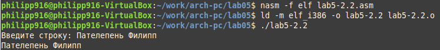

# Вывод

Я приобрел практические навыки работы в Midnight Commander. Освоил инструкции языка ассемблера mov и int. 

# Список литературы

1. GDB: The GNU Project Debugger. — URL: https://www.gnu.org/software/gdb/. 
2. GNU Bash Manual. — 2016. — URL: https://www.gnu.org/software/bash/manual/. 
3. Midnight Commander Development Center. — 2021. — URL: https://midnight-commander. org/.
4. NASM Assembly Language Tutorials. — 2021. — URL: https://asmtutor.com/.
5. Newham C. Learning the bash Shell: Unix Shell Programming. — O’Reilly Media, 2005. — 354 с. — (In a Nutshell). — ISBN 0596009658. — URL: http://www.amazon.com/Learningbash-Shell-Programming-Nutshell/dp/0596009658. 
6. Robbins A. Bash Pocket Reference. — O’Reilly Media, 2016. — 156 с. — ISBN 978-1491941591. 
7. The NASM documentation. — 2021. — URL: https://www.nasm.us/docs.php. 
8. Zarrelli G. Mastering Bash. — Packt Publishing, 2017. — 502 с. — ISBN 9781784396879. 
9. Колдаев В. Д., Лупин С. А. Архитектура ЭВМ. — М. : Форум, 2018. 
10. Куляс О. Л., Никитин К. А. Курс программирования на ASSEMBLER. — М. : Солон-Пресс, 2017. 
11. Новожилов О. П. Архитектура ЭВМ и систем. — М. : Юрайт, 2016. 
12. Расширенный ассемблер: NASM. — 2021. — URL: https://www.opennet.ru/docs/RUS/nasm/. 
13. Робачевский А., Немнюгин С., Стесик О. Операционная система UNIX. — 2-е изд. — БХВПетербург, 2010. — 656 с. — ISBN 978-5-94157-538-1. 
14. Столяров А. Программирование на языке ассемблера NASM для ОС Unix. — 2-е изд. — М. : МАКС Пресс, 2011. — URL: http://www.stolyarov.info/books/asm_unix. 
15. Таненбаум Э. Архитектура компьютера. — 6-е изд. — СПб. : Питер, 2013. — 874 с. — (Классика Computer Science). 
16. Таненбаум Э., Бос Х. Современные операционные системы. — 4-е изд. — СПб. : Питер, 2015. — 1120 с. — (Классика Computer Science). 
